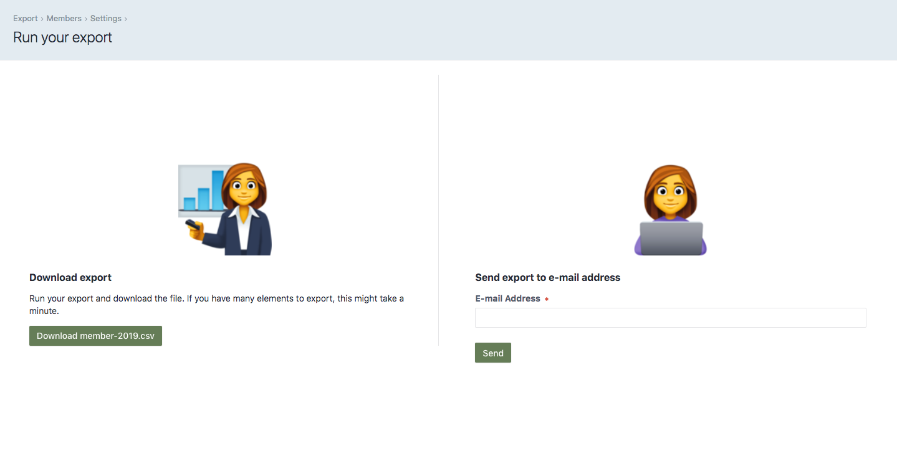
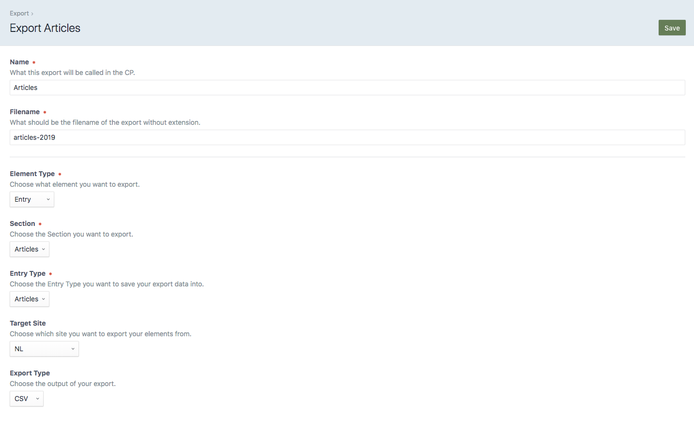
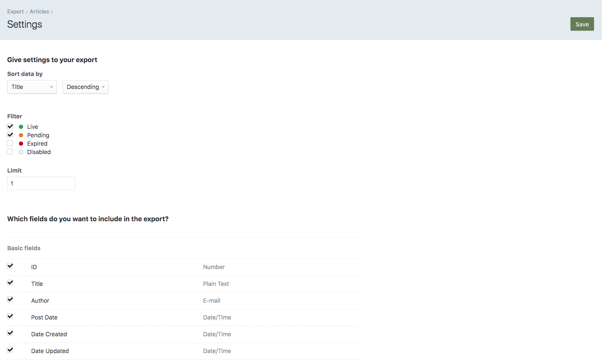

# Export plugin for Craft CMS 3.x

Export elements from Craft

## Requirements

This plugin requires Craft CMS 3.0.0-beta.23 or later.

## Installation

To install the plugin, follow these instructions.

1. Open your terminal and go to your Craft project:

        cd /path/to/project

2. Then tell Composer to load the plugin:

        composer require statikbe/export

3. In the Control Panel, go to Settings → Plugins and click the “Install” button for Export.

## Export Overview

Create exports.

Choose your custom settings.

Brought to you by [Statik](https://statik.be)
